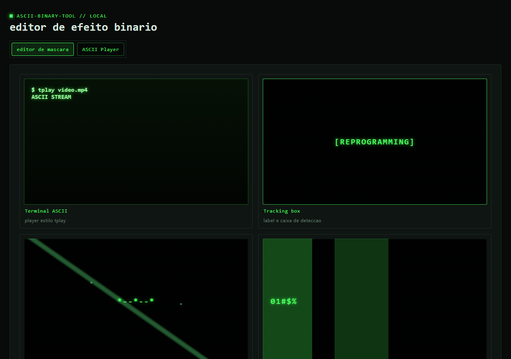
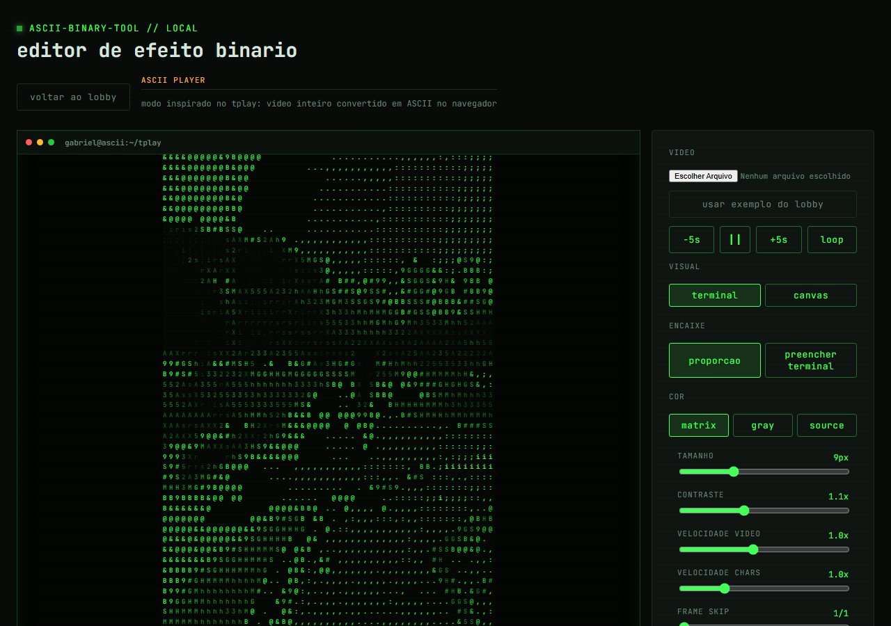

# ascii-binary-tool

Editor local de video criativo focado em efeitos ASCII, binary rain, glitch,
tracking visual e camadas simples. O projeto roda no Windows com FastAPI,
OpenCV/ffmpeg e Vite/React.

A ideia inicial era aplicar um efeito "Matrix/binary rain" em uma silhueta
segmentada. Hoje a ferramenta esta virando uma pequena suite local para criar
videos curtos com identidade tech/ASCII/glitch, sem depender de servicos pagos.

## Status atual

O app tem 3 ferramentas principais no lobby.

### 1. Editor de mascara

Fluxo original da ferramenta:

- upload de video
- selecao de um ou mais intervalos
- extracao de frames
- geracao automatica de mascara
- edicao manual com pincel/borracha
- preview do efeito
- export final em MP4

Recursos atuais:

- multiplos intervalos no mesmo video
- preview limitado aos intervalos selecionados
- mascara automatica por IA/fallback de movimento
- propagacao/copia de mascara entre frames
- zoom no canvas de edicao
- efeitos combinaveis: binary rain, tracking box, mesh lines, blink, scan reveal, glitch panel
- fundo solido, fundo do video original ou imagem enviada
- cor, mapa de caracteres, velocidade e densidade configuraveis
- SFX local/offline gerado com ffmpeg no export
- export de frame ASCII como `.txt`

### 2. ASCII Player

Ferramenta separada inspirada no [`maxcurzi/tplay`](https://github.com/maxcurzi/tplay).
Ela roda videos como ASCII/terminal dentro do browser.

Recursos atuais:

- modo terminal
- modos de cor: verde, cinza e cor do video
- ajuste de caracteres
- ajuste de tamanho/densidade
- opcoes de movimento dos caracteres
- export de frame ASCII
- export de video estilo terminal
- opcao para adaptar video vertical ao tamanho do terminal

Este projeto nao depende do `tplay`; a referencia e conceitual/visual.

### 3. Editor de video / camadas

Nova direcao do projeto. A ideia e ter uma timeline simples, sem tentar virar
Premiere/CapCut, mas suficiente para montar videos curtos com efeitos tech.

Status atual:

- rota `#layers`
- upload/dropzone proprio
- timeline com tracks:
  - video base
  - efeitos
  - texto/imagem
  - audio/SFX
- selecao de trecho com inicio/fim
- play do trecho selecionado
- presets:
  - Matrix silhouette
  - Tracking HUD
  - Glitch scan
  - Tech SFX
- clips editaveis:
  - nome
  - efeitos ativos
  - cor
  - fundo cor/video
  - SFX e volume
- export inicial de timeline
- backend ja renderiza clips de efeito com parametros diferentes por clip

Limites atuais do editor de camadas:

- texto/imagem ainda aparecem no modelo, mas nao renderizam no video
- clips ainda nao sao movidos/redimensionados diretamente arrastando na timeline
- SFX ainda precisa evoluir para parametros totalmente independentes por clip
- preview rapido da timeline ainda depende de export pesado
- projeto ainda nao e salvo/carregado como arquivo

## Screenshots

### Lobby com presets



### ASCII Player estilo terminal



## Onde queremos chegar

O destino do projeto e uma ferramenta local de video criativo, focada em:

- efeitos Matrix/binary/ASCII/glitch por trecho
- silhueta com mascara editavel
- timeline simples com camadas
- texto/imagem/SFX por intervalo
- export local com ffmpeg
- fluxo rapido para criar clipes curtos de portfolio, TikTok/Reels ou teste visual

Nao queremos virar um editor generico completo. O diferencial deve ser uma
experiencia enxuta para criar efeitos visuais tech com controle local.

Roadmap pratico:

1. Finalizar SFX independente por clip.
2. Renderizar camada de texto.
3. Renderizar camada de imagem.
4. Permitir mover/redimensionar clips na timeline.
5. Adicionar zoom da timeline.
6. Criar preview rapido de timeline.
7. Salvar/carregar projeto local.
8. Otimizar render de mascara/efeito para trechos maiores.
9. Atualizar screenshots e README conforme a UI estabilizar.

## Stack

- `backend/`: FastAPI, OpenCV, rembg, ffmpeg via subprocess.
- `frontend/`: Vite, React, TypeScript, canvas puro.

Arquivos principais:

- `backend/main.py`: endpoints, upload, segmentacao, preview e export
- `backend/segmentation.py`: mascara automatica/fallback
- `backend/render.py`: renderizador do binary rain
- `frontend/src/UploadTrim.tsx`: lobby/upload/selecao de trechos
- `frontend/src/Editor.tsx`: editor de mascara
- `frontend/src/AsciiPlayer.tsx`: player ASCII/terminal
- `frontend/src/VideoLayerEditor.tsx`: editor de video/camadas
- `frontend/src/api.ts`: cliente HTTP

## Rodar localmente no Windows

Backend:

```powershell
cd backend
python -m venv venv
venv\Scripts\activate
pip install -r requirements.txt
python -m uvicorn main:app --reload --port 8000
```

Frontend:

```powershell
cd frontend
npm install
npm run dev
```

Abra o Vite em `http://127.0.0.1:5173/` ou na porta que ele informar.

## Dependencias importantes

- Python no Windows deve ser chamado como `python`, nao `python3`.
- `ffmpeg` precisa estar instalado no sistema e disponivel no `PATH`.
- Se instalar o ffmpeg durante a sessao, feche e abra o VS Code inteiro para o
  terminal herdar o PATH atualizado.
- O backend aceita qualquer porta localhost do Vite via CORS regex.

## Notas de desenvolvimento

- O app e local-first; nao ha deploy/hospedagem por enquanto.
- O export depende de ffmpeg e pode ser lento em trechos maiores.
- O render do binary rain ainda tem partes em loop Python/OpenCV; otimizar com
  numpy e um caminho importante para performance.
- O armazenamento atual fica em `backend/storage` e e tratado como workspace
  local/temporario.
